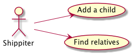
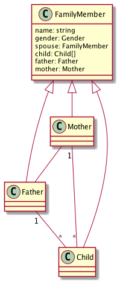
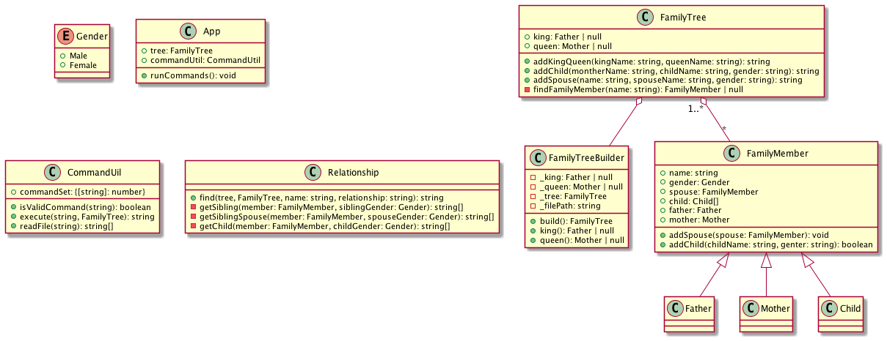
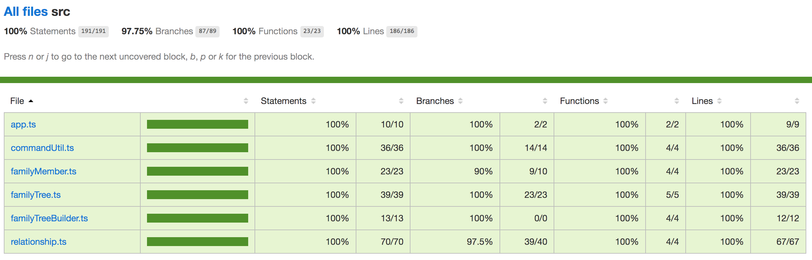

# Family Tree

The app will by default load the Arthur family tree during initilization. All below commands are runnable under project root folder.
## Docker Execution (Recommended)

- Prepare docker container

    ```
    // build docker image
    $ docker build -t evaou/family-tree-app .

    // get docker image id
    $ docker images | grep family-tree-app | awk '{print $3}'

    // run docker container
    $ docker run -itd <docker-image-id>

    // get docker container id
    $ docker ps | grep <docker-image-id> | awk '{print $1}'
    ```

- Run program

    ```
    $ docker exec -it <docker-container-id> npm run start ./tests/input/shippit-example.txt
    $ docker exec -it <docker-container-id> npm run start ./tests/input/shippit-sample-1.txt
    $ docker exec -it <docker-container-id> npm run start ./tests/input/shippit-sample-2.txt
    $ docker exec -it <docker-container-id> npm run start ./tests/input/shippit-sample-3.txt
    ```

- Run test

    ```
    $ docker exec -it <docker-container-id> npm run test
    $ docker exec -it <docker-container-id> npm run test -- -grep "shippit"
    $ docker exec -it <docker-container-id> npm run test -- -grep "familyTree"
    $ docker exec -it <docker-container-id> npm run test coverage
    ```

- Run program with host input file

    ```
    // run docker container mounted with host input directory
    $ docker run -v <host-input-directory-absolute-path>:/app/shippit-input -itd <docker-image-id>

    $ docker exec -it <docker-container-id> npm run start ./shippit-input/<host-input-filename>
    ```
## Local Execution

- Run program

    ```
    $ npm run start ./tests/input/shippit-example.txt
    $ npm run start ./tests/input/shippit-sample-1.txt
    $ npm run start ./tests/input/shippit-sample-2.txt
    $ npm run start ./tests/input/shippit-sample-3.txt

    // test another input file
    $ npm run start <test-file-path>
    ```

- Run test

    ```
    $ npm run test
    $ npm run test -- -grep "shippit"
    $ npm run test -- -grep "familyTree"
    $ npm run coverage
    ```

## Plan

1. Domain-Driven Design (DDD)
2. Test-Driven Development (TDD)
3. Dockerization

## Design

- Use case diagram



- Domain model



- Class diagram



## Test Coverage
Test coverage report is at _./coverage/lcov-report/tests/index.html_

