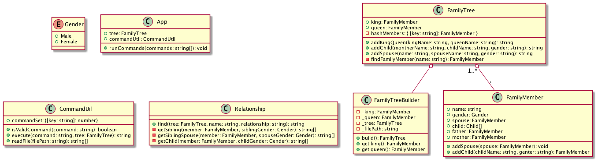

# Family Tree

The app will by default load the Arthur family tree during initialization. All below commands are executable under project root folder.

## Docker Execution (Recommended)

- Prepare docker image

    ```
    // build docker image
    $ docker build -t evaou/family-tree-app .

    // get docker image id
    $ docker images | grep family-tree-app | awk '{print $3}'
    ```

- Prepare docker container

    ```
    // run docker container and mount with host input directory
    // e.g. docker run -v /Users/evaou/test:/app/input -itd db0efd8cdccc
    $ docker run -v <host-input-directory-absolute-path>:/app/input -itd <docker-image-id>

    // get docker container id
    // e.g. docker ps | grep db0efd8cdccc | awk '{print $1}'
    $ docker ps | grep <docker-image-id> | awk '{print $1}'
    ```

- Run program

    ```
    $ docker exec -it <docker-container-id> node dist/src/cli ./tests/input/example.txt
    $ docker exec -it <docker-container-id> node dist/src/cli ./tests/input/sample-1.txt
    $ docker exec -it <docker-container-id> node dist/src/cli ./tests/input/sample-2.txt
    $ docker exec -it <docker-container-id> node dist/src/cli ./tests/input/sample-3.txt
    ```

- Run program with host input file

    ```
    // Below file path needs to exist before execution
    // <host-input-directory-absolute-path>/<host-input-filename>
    // e.g. docker exec -it f9dc586a078b node dist/src/cli ./input/sample-4.txt
    $ docker exec -it <docker-container-id> node dist/src/cli ./input/<host-input-filename>

    // Unhappy path will show below message
    // e.g. docker exec -it 91a1444dc2b6 node dist/src/cli /unhappy-path/Users/evaou/test/sample-4.txt
    //  Below file doesn't exist
    //  /unhappy-path/Users/evaou/test/sample-4.txt
    // e.g. docker exec -it 91a1444dc2b6 node dist/src/cli ./input/sample-5.txt
    //  Below file doesn't exist under mounted host directory
    //  sample-5.txt
    ```

- Run test

    ```
    $ docker exec -it <docker-container-id> npm run test
    $ docker exec -it <docker-container-id> npm run test -- -grep "familyTree"
    $ docker exec -it <docker-container-id> npm run test coverage
    ```

## Local Execution

- Prepare build

    ```
    $ npm install
    $ npm run build
    ```

- Run program

    ```
    $ node dist/src/cli ./tests/input/example.txt
    $ node dist/src/cli ./tests/input/sample-1.txt
    $ node dist/src/cli ./tests/input/sample-2.txt
    $ node dist/src/cli ./tests/input/sample-3.txt
    ```

- Run program with host input file

    ```
    // e.g. node dist/src/app /Users/evaou/test/sample-4.txt
    $ node dist/src/cli <host-input-file-absolute-path>

    // Unhappy path will show below messages
    // e.g. node dist/src/cli /unhappy-path/Users/evaou/test/sample-4.txt
    //   Below file doesn't exist
    //   /unhappy-path/Users/evaou/test/sample-4.txt
    ```

- Run test

    ```
    $ npm run test
    $ npm run test -- -grep "familyTree"
    $ npm run coverage
    ```

## Plan

1. Domain-Driven Design (DDD)
2. Test-Driven Development (TDD)
3. Dockerization

## Design

- Use case diagram


- Class diagram



## Test Coverage
Test coverage report is at _./coverage/lcov-report/tests/index.html_

